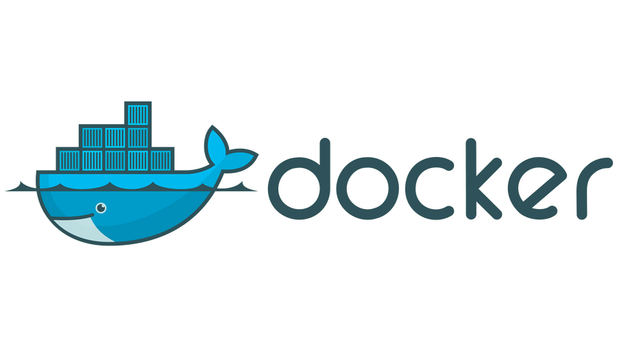
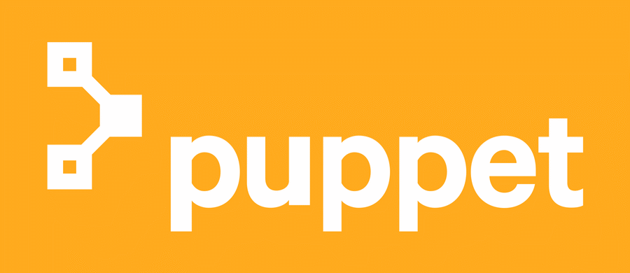
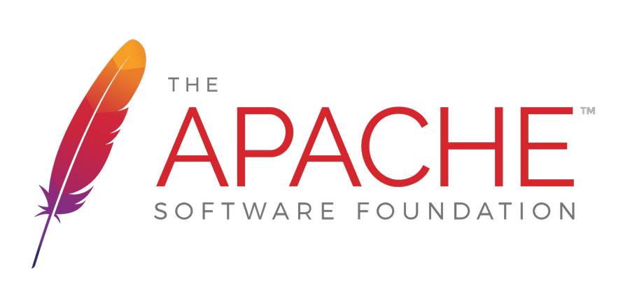
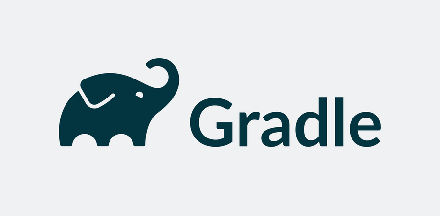

# Devops Tools

## What is DevOps?
DevOps is a set of practices that combines software development and IT operations.
It aims to shorten the systems development life cycle and provide continuous delivery
with high software quality. DevOps is complementary with Agile software development;
several DevOps aspects came from the Agile methodology.

## What Are DevOps Tools?
DevOps works in the cross-functional mode, involving various tools of various kinds and
purposes, instead of just a single tool. These tools are also known as DevOps toolchains,
as discussed above.
The tools help throughout the software production lifecycle, including development,
management, and delivery.
The organization that uses DevOps practice coordinates these tools and fits each one of
them into one or more production activities like planning, creation, verification,
packaging, releasing, configuring, monitoring, and version control.
We have segmented various DevOps tools based on the production activities that they
can fit into.

## 1. DevOps Automation Tools
These are some of the popular DevOps automation tools:

### 1.1 Jenkins

<a href="https://dmiot.ir">  
    

</a>

[Jenkins](https://www.jenkins.io/) is an open source and free automation server that helps automate software
development processes such as building, facilitating CI/CD, deploying, and testing.
This DevOps tool makes it easy for teams to monitor repeated tasks, integrate changes
easily, and identify issues quickly.

Features and Benefits:

- Jenkins supports 100+ plugins to integrate with almost every tool available in
the CI/CD toolchain, such as Git, Amazon EC2, Maven, etc.
- It’s a self-contained program written in Java that works across major platforms,
including Windows, macOS, Linux, and Unix systems.
- You can set and configure Jenkins easily using its simple web interface with
built-in error checks and helps.
- Jenkins is super extensible through plugins, so you can perform a range of
additional functionalities.
- Since it’s extensible, Jenkins can easily be used as a CI/CD tool for any software
development project.
- As it’s a Java-based DevOps tool, you can easily distribute it across machines
to accelerate builds, tests, as well as deployments

### 1.2 Docker

<a href="https://dmiot.ir">  
    

</a>

A leader in software containerization, [Docker](http://docker.com) is used by 11 million+ developers across the world. Solomon Hykes is its original author and it was released in 2013 by Docker, Inc.
As a DevOps tool, Docker helps developers to build, package, and then deploy the codes with ease and speed via containers with needed dependencies instead of virtual machines. It eliminates mundane configuration activities and fosters effective team collaboration.
Docker ensures that the same software development environment is maintained across every stage of a DevOps cycle, from development to staging and production. It empowers the developers to create Docker images that they can run in the development environment and operation teams to perform testing and deployments.

Features and Benefits:

- Docker uses OS-level virtualization to deliver applications in packages referred to as a container. It isolates these containers from each other and bundles the software, configuration files, and libraries, making them transferable and more secure.
- It works easily with GCP and AWS and simplifies cloud migration
- Docker facilitates distributed development
- The tool makes it easy to add features and perform fixes
- Docker runs in Windows, macOS, and Linux
- It integrates well with deployment pipeline tools like CircleCI, GitHub, etc.
- It offers both open source and commercial solutions
- Docker is used by enterprises like Netflix, Adobe, AT&T, PayPal, etc.

### 1.3 Puppet

<a href="https://dmiot.ir">  
    

</a>

Developed by Puppet, Inc. and founded in 2005 by Luke Kanies, [Puppet](https://puppet.com) is an open-source tool for software configuration management.
This DevOps automation tool helps manage different software lifecycle stages such as provisioning of IT infrastructure, patching, and configuration & management of software components and OS across cloud infrastructures and data centers.

Features and Benefits:

- It’s written in C++, Ruby, and Clojure and works with Windows, Linux, and Unix-like operating systems.
- Puppet is a model-driven tool that needs limited use of programming language.
- It uses a declarative language of its own to define system configuration
- It helps reduce manual errors and supports your team to scale with infrastructure as Code and agentless automation
- Puppet’s commercial software offers out-of-the-box reporting, node management, orchestration, product support, and access control

### 1.4 Apache Maven

<a href="https://dmiot.ir">  
    

</a>

Developed by the Apache Software Foundation and released in 2004, [Maven](https://maven.apache.org/) is an efficient build automation tool. Written in Java, it’s used mainly for Java-based projects and acts as a project management and a comprehension tool.
As a DevOps tool, it helps manage the build, documentation, and reporting of a project. Apart from Java-based projects, you can also use Maven to develop and manage software projects written in Ruby, C#, Scala, and others.

Features and Benefits:

- Maven has predefined targets to perform well-defined tasks like code compilation and packaging.
- It downloads Maven plugins and Java libraries from its repositories to help accelerate the development process.
- It has the Apache License 2.0
- Maven comes with excellent dependency management such as automatic updating, transitive dependencies, and dependency closures.

### 1.5 Gradle

<a href="https://dmiot.ir">  
    

</a>

Accelerate your software development productivity using Gradle. This is also amongst open-source DevOps tools for build automation, especially for multi-language application or software development.
Gradle is written in Java, Kotlin, and Groovy and was released in 2007. It’s used to automate software development, testing, and deployment at improved speeds.

Features and Benefits:

- Gradle has a rich API along with an advanced ecosystem of integrations and plugins to help with automation so that you can develop, integrate, and then systematize end-to-end software delivery.
- It has the Apache License 2.0
- Introduces a Kotlin based and Groovy-based DSL
- Uses directed acyclic graphs to prioritize tasks to run via dependency management.
- It helps you scale out your development easily with blazing-fast builds.
- Useful for developing mobile applications to microservices
- It’s versatile and can be used by start-ups and enterprises both